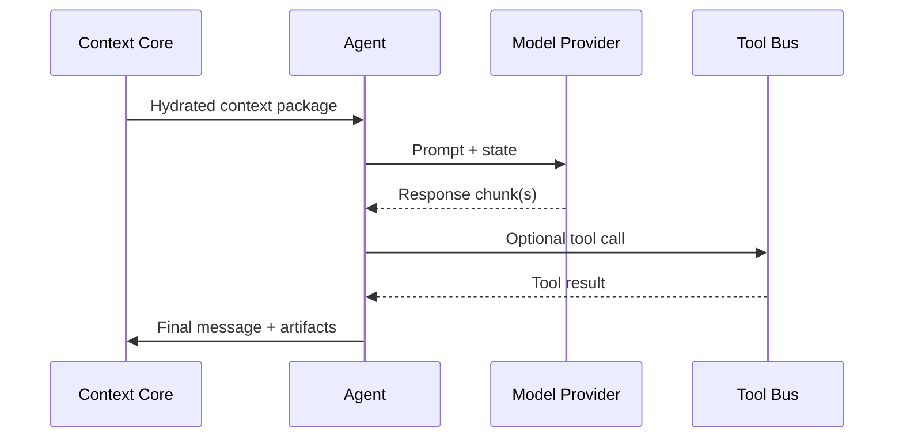

# Agent lifecycle

Every agent in ContextAgent follows the same lifecycle regardless of the underlying LLM provider. Understanding the lifecycle helps you inject custom logic and diagnose misbehaving runs.

## 1. Hydrate

- Load the agent's prompt template and defaults from the context core.
- Merge run-specific state such as the user query, datasets, and tool outputs.
- Resolve model + provider, picking overrides if supplied by the pipeline.

## 2. Plan

Agents can request **plan fragments** before calling the LLM. Use this phase to:

- Expand tasks into bulletproof checklists.
- Benchmark available tools and select the minimal set required.
- Emit guardrail prompts or self-check instructions.

Enable planning via the pipeline config (`plan: true`) and inspect traces in the observability UI.

## 3. Execute

During execution the agent can stream partial tokens back to the context core. Tool calls suspend the LLM stream until results arrive.

## 4. Reflect

After the LLM returns, the agent optionally performs self-critique:

!!! tip "Self-reflection modules"
    - **Checklists** — ensure required sections are present.
    - **Classifiers** — rate quality or completeness.
    - **Automatic retries** — re-run with additional instructions if metrics fall below thresholds.

Reflections are stored as artifacts so the pipeline can branch based on quality signals.

## 5. Hand off

The agent emits a structured message back to the context core. Pipelines decide whether to:

- Transition to a downstream agent.
- Persist artifacts.
- Return the final output to the caller.

Next, learn how the [context engine](context-engine.md) coordinates shared state.
