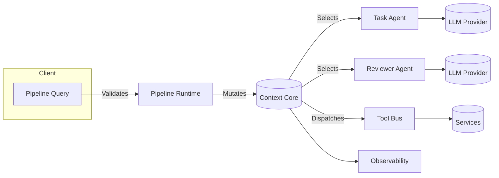

# Architecture

ContextAgent centers on a **context core** that every agent connects to. Pipelines orchestrate the core, agents execute tasks through LLM providers, and tools expose capabilities back to the core.

## System layers

1. **Pipeline runtime** — entry point that maps queries to structured runs, handles retries, and stitches together steps.
2. **Context core** — stores prompt templates, run state, artifacts, and memory so that every agent acts on shared truth.
3. **Agents** — lightweight wrappers over LLM clients; each agent references a template in the context core.
4. **Tools** — external capabilities (search, code execution, vector DB) registered with the context core and gated via policies.
5. **Observability** — auto-traced spans, structured logs, and artifacts pushed to disks or remote stores.

## Configuration model

- **YAML pipeline configs** define agents, prompt templates, default models, tool access, and tracing settings.
- **Profiles** expose reusable bundles of context so you can version prompts independently of pipelines.
- **Artifacts** capture intermediate datasets, summaries, or generated files; the context core makes them discoverable per run.

!!! info "Recommended folder layout"
    - `pipelines/configs/*.yaml` — pipeline definitions
    - `contextagent/profiles/` — prompt templates + state defaults
    - `contextagent/tools/` — structured tool definitions
    - `data/` — input datasets or assets consumed by pipelines

## Deployment topology

| Mode | Description | Best for |
| ---- | ----------- | -------- |
| Local | Single process running pipelines on demand | Prototyping, testing |
| Worker Fleet | Pipelines dispatched to async workers via queues | Production workloads |
| Hybrid | Local for experiments, remote for heavy agents | Teams with mixed needs |

Continue with the [Agent Lifecycle](agent-lifecycle.md) to understand how agents progress during a run.
