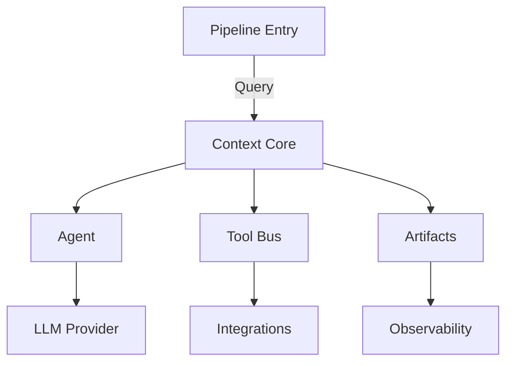

--8<-- "includes/hero.md"

## Why ContextAgent

- **Context is the API** — define prompts, memory, and tool state once and reuse across any agent.
- **Pipeline-first ergonomics** — compose async steps with tracing, retries, and analytics built in.
- **Bring your own models** — mix and match OpenAI, Claude, Gemini, DeepSeek, and self-hosted models per agent.
- **Production backed** — audit logs, artifact storage, and MCP integration to ship safely.

## What you can build

!!! example "Popular scenarios"
    - Research teammates that synthesize web findings into structured briefs.
    - Workflow copilots that translate requirements into actions across your SaaS stack.
    - Data science orchestrators that run explorations, modeling, and reporting end-to-end.

## Try it in minutes

=== "Python"
    ```bash
    uv sync
    uv run python -m examples.web_researcher
    ```

=== "CLI"
    ```bash
    uv run contextagent --help
    ```

## Architecture at a glance



--8<-- "includes/feature-grid.md"

--8<-- "includes/cta.md"
